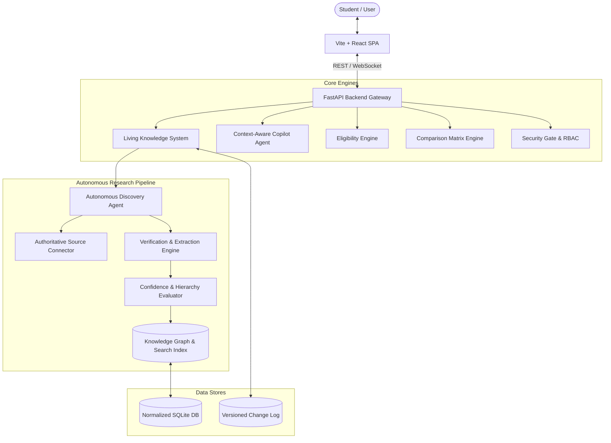

# EDUVA AI System Architecture

## Architectural Overview

EDUVA AI is built on a decoupled, reactive, event-driven architecture designed to process, verify, and deliver authoritative educational intelligence at scale.

### Source Hierarchy
- **Level 1 — Authoritative**: Government of Nepal, Ministry of Education (MOEST), University Central Examination Boards, Medical Education Commission (MEC), Nepal Engineering Council (NEC).
- **Level 2 — Trusted**: Recognized institutional journals, campus gazettes, accredited colleges.
- **Level 3 — Discovery Only**: General directories, community feeds. Used strictly to discover potential entities, never to verify critical claims.\n